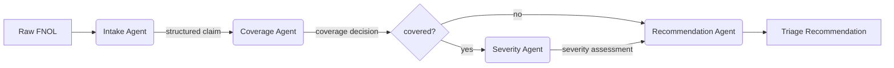

# claims-triage-agents

> A small but working multi-agent system that triages a first-notification-of-loss through specialist agents intake, coverage, severity, recommendation built with LangGraph and Python. Deliberate stack-closing exercise; not a production system.

---

## Why this repo exists

I'm applying for a Senior AI Engineer role at Aviva. My background is unusual for the title: six years as a Claims Analyst at Marsh McLennan, where I contributed to the rollout of LenAI, Marsh McLennan's enterprise generative AI assistant, used across 90,000+ employees and independently credited (Oliver Wyman, Rubrik) with saving over 1 million team hours in its first year. I now run a one-person e-commerce operation built on LLM-based agents.

What I don't have on paper is a decade of production Python and AWS. What I do have is rare: I've been inside a large-scale enterprise GenAI rollout in a regulated industry, and I'm closing the engineering gap deliberately.

This repo is the evidence of that close. It's small. It's honest about its limits. And it does something that matters: it shows I can specify, build, test, and ship a working agentic system in the domain I know best, insurance claims.

If the work product matters more to you than the job title on the CV, read on.

---

## What it does

Given a raw first-notification-of-loss (FNOL), the message an insurer receives when a claim is opened, the system routes it through four specialist agents and produces a structured recommendation.



Each agent is a focused LLM call with a tight Pydantic-typed output. The graph is a LangGraph `StateGraph` with a single shared state passed between nodes. Conditional edges short-circuit the severity step when there's no coverage to assess.

**Sample input** (a high-severity FNOL):

```json
{
  "policy_number": "MM-PL-44721",
  "claimant": "Acme Logistics Inc.",
  "loss_date": "2026-03-14",
  "description": "Tractor-trailer rollover on I-40 near Amarillo, TX. Driver hospitalised with suspected concussion. Cargo (electronics, est. value $480k) total loss. Second vehicle involved, no injuries reported. Police report filed."
}
```

**Sample output:**

```json
{
  "covered": true,
  "policy_in_force": true,
  "exclusions_triggered": [],
  "severity": "high",
  "severity_rationale": "Bodily injury with hospitalisation; high-value cargo total loss; third-party involvement; multi-jurisdictional.",
  "recommended_action": "route_to_specialist",
  "specialist_team": "Casualty - North American Trucking",
  "reasoning": "Severity threshold (bodily injury + > $250k loss + third-party) requires senior adjuster ownership. Recommend immediate notification to London market reinsurer per programme terms.",
  "confidence": 0.87
}
```

---

## Architecture

| Component | Stack | Why |
|---|---|---|
| Orchestration | LangGraph | Named in the Aviva JD; gives explicit state machine semantics, conditional edges, and clean separation of agents |
| Models | Anthropic API (`claude-sonnet-4-7`) | Fast, structured outputs reliable; cost-effective for this volume |
| State | Pydantic | Type-safe state propagation; structured outputs enforced |
| Logging | Standard library + JSON formatter | Every agent invocation produces a structured log line: token usage, latency, decision, confidence |
| API | FastAPI | Idiomatic Python web framework; ASGI-ready for Lambda or container deployment |
| Tests | pytest | Smoke tests on fixtures; eval harness for end-to-end |
| Infra | Terraform stub | AWS Lambda + API Gateway pattern; structurally credible, not deployed |

See [docs/architecture.md](docs/architecture.md) for the agent-by-agent design rationale.

---

## Setup

```bash
git clone https://github.com/UserCorbett/claims-triage-agents.git
cd claims-triage-agents

# Create venv
python -m venv .venv
.venv\Scripts\activate          # Windows
# source .venv/bin/activate     # macOS/Linux

# Install
pip install -e ".[dev]"

# Configure
cp .env.example .env
# Open .env and add your ANTHROPIC_API_KEY
```

## Run

```bash
# CLI: triage a single FNOL
python -m claims_triage tests/fixtures/fnol_high_severity.json

# API: serve the FastAPI app
uvicorn api.main:app --reload
# POST a FNOL JSON to http://localhost:8000/triage

# Tests
pytest

# Eval: run all fixtures and print pass/fail
python eval/run_eval.py
```

---

## What's deliberately out of scope (and why)

A senior engineer reading this will spot what's missing. To save you the time:

- **No real deployment.** The Terraform under `infra/` is a stub, it's structurally a Lambda + API Gateway + IAM setup, but I haven't run it. The point is to show I understand the deployment shape, not to claim I've shipped to production AWS.
- **No real policies.** `policies.py` is a small synthetic library. Real coverage logic in a real insurer would hit policy admin systems and have a hundred edge cases this doesn't.
- **No human-in-the-loop UI.** Every triage system needs one in production. Out of scope here.
- **No production-grade observability.** Structured JSON logs only; no OpenTelemetry, no traces, no LangSmith integration. Easy to add; deliberate omission for v1.
- **No fine-tuning, no RAG.** Pure prompt-engineered structured outputs. This is the right starting point for triage; the moment you need claim-history retrieval you'd add RAG.
- **No PII handling.** Test fixtures are synthetic. Real deployment would need redaction at intake and per-agent data minimisation.

What this repo *is*: a credible, working demonstration that I can specify, build, test, and ship an agentic system end-to-end. What it *isn't*: a production claims platform.

---

## What I'd build next, given a week

1. Replace the synthetic policy library with a small RAG layer over a corpus of policy wordings chunking strategy matters
2. Add LangSmith integration for trace observability the JD's "monitoring and observability in production systems" line
3. Add a human-in-the-loop checkpoint between severity and recommendation for high-severity claims
4. Replace the Terraform stub with an actual deployment; add a CI workflow that runs eval on PRs and fails the build if scores drop
5. Add a small evaluation harness with LLM-as-judge for the recommendation quality

---

## What LenAI taught me

The standalone document   [LESSONS_FROM_LENAI.md](LESSONS_FROM_LENAI.md)   is the part of this repo I'd point a hiring manager at first. It's the genuinely rare thing I bring: lessons from being inside a 90k-user enterprise GenAI rollout in a regulated industry, written for a team about to do similar work.

---

## About me

Leon Corbett · Norwich · [lcorbett@protonmail.com](mailto:lcorbett@protonmail.com)

Six years at Marsh McLennan on Fortune 500 casualty and property claims. CII member. Now running an automated multi-marketplace e-commerce operation on LLM-based agents. Closing the engineering stack gap deliberately; this repo is part of that.

---

## License

MIT   see [LICENSE](LICENSE). Use it however you like.
