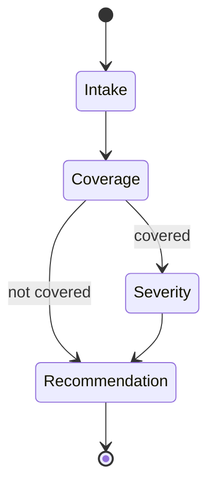

# Architecture

## Design principles

1. **Each agent does one thing.** Intake parses, coverage decides, severity assesses, recommendation synthesises. No agent is asked to do another's job.
2. **State is typed.** A single Pydantic `TriageState` flows through the graph. Agents read from it and write to it; nothing escapes.
3. **The graph is the orchestration.** Conditional routing (e.g., skip severity when there's no coverage) lives in the graph, not inside agents.
4. **Failure modes are explicit.** Every agent's output schema includes a confidence field. Low confidence on coverage routes to a human-review path (out of scope for v1; designed in).

## State model

```python
class TriageState(BaseModel):
    raw_fnol: str
    intake: ClaimIntake | None = None
    coverage: CoverageDecision | None = None
    severity: SeverityAssessment | None = None
    recommendation: TriageRecommendation | None = None
    trace: list[AgentTrace] = []
```

`AgentTrace` captures per-agent: agent name, input snapshot, output, token usage, latency, confidence. The trace becomes the structured log line emitted at each node.

## Agents

### Intake

- **Input:** raw FNOL text.
- **Output:** `ClaimIntake(policy_number, claimant, loss_date, loss_type, description, severity_indicators)`.
- **Prompt strategy:** Few-shot with 2–3 examples of FNOLs of varying quality (terse, verbose, ambiguous). Structured output via Pydantic.
- **Failure mode:** Missing critical fields trigger a `needs_clarification` flag, not an empty record.

### Coverage

- **Input:** `ClaimIntake` + the policy library (`policies.py`).
- **Output:** `CoverageDecision(covered, policy_in_force, exclusions_triggered, reasoning)`.
- **Logic:** Looks up policy by number; checks loss_date against policy effective/expiry dates; runs loss type against exclusions list. The agent does interpretive work — exclusions are written in legal English in real policies, and the LLM does meaningful work parsing them against the loss.
- **Failure mode:** Unknown policy returns `covered=False, reasoning="policy not found"` — does not hallucinate coverage.

### Severity

- **Input:** `ClaimIntake` + `CoverageDecision`.
- **Output:** `SeverityAssessment(severity: low|medium|high, rationale, indicators)`.
- **Logic:** Weights bodily injury, financial magnitude, third-party involvement, regulatory exposure. Returns explicit indicator list so the assessment is auditable.
- **Skipped** in the graph when coverage = none.

### Recommendation

- **Input:** all upstream state.
- **Output:** `TriageRecommendation(recommended_action, specialist_team, reasoning, confidence)`.
- **Actions:** `route_to_specialist | request_more_info | fast_track | decline_with_explanation`.
- **Specialist team:** Selected from a small enum (`Casualty - North American Trucking`, `Property - International`, `Liability - Professional`, etc.) — synthetic but realistic.

## Graph



LangGraph `StateGraph` with conditional edge after Coverage. State accumulates; nothing is overwritten.

## Why these design choices, given the JD

| JD requirement | How it's met in this repo |
|---|---|
| Agentic frameworks (LangGraph) | LangGraph `StateGraph` with conditional edges and shared typed state |
| AWS / CI / IaC | Terraform stub (Lambda + API Gateway) in `infra/`; deployable shape, not deployed |
| Containerised deployment | (Out of scope v1; FastAPI is ASGI so the Lambda or Docker path is straightforward) |
| Regulated environment awareness | Synthetic-only data; design includes a human-review path for low-confidence coverage; no PII in fixtures |
| Communicate clearly to non-specialists | This document; the README; the LESSONS file |
